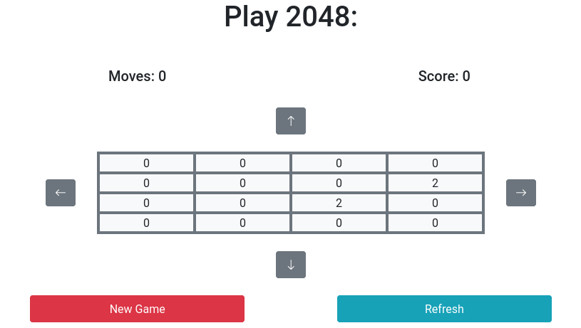

= Exercise 03
:author: Florian Weingartshofer
:email: <S1910307103@students.fh-hagenberg.at>
:reproducible:
:experimental:
:listing-caption: Listing
:source-highlighter: rouge
:rouge-style: github
:toc:
:sectnums:
:sectnumlevels: 6
:toclevels: 6
// Variables
:src: ../src/euro-bet-server/src/main/java/swe4
:fxml: ../src/euro-bet-server/src/main/resources/swe4/client
:img: ./img
:imagesoutdir: ./out

<<<
== Test Maven Project
.Maven Compile
image::{img}/mvn_compile.png[]

.Maven Test
image::{img}/mvn_test.png[]

.Maven Package
image::{img}/mvn_package.png[]

.Maven Tomcat
image::{img}/mvn_tomcat.png[]

.Local Webpage

<<<
== Deployment on Gitlab
I already have all the exercises in a git repository, so I added a yml config, for the pipelines to work.

.Outer Gitlab CI File
[source,yml]
----
include::../../.gitlab-ci.yml[]
----

.Gitlab CI File for the Project
[source,yml]
----
include::../.gitlab-ci.yml[]
----

.Passed Stages

.Running Tomcat From Gitlab Runner
image::{img}/gitlab_runner_tomcat.png[]

.Website Started From Gitlab Runner

.Stopped Tomcat From Gitlab Runner

<<<
== Deployment On GitHub Actions
Again since this Repository contains more than one project, the workflow had to be changed a little.

.GitHub Workflow
[source,yml]
----
include::../../.github/workflows/maven.yml[]
----

.GitHub Action

.GitHub Action Deployment

<<<
== Deploy Documentation To GitHub Pages
I also added a deployment file, to deploy the documentation to GitHub Pages.
It should be available at https://flohero.github.io/se-spw/[]

[source,yml]
----
include::../../.github/workflows/build-adoc.yml[]
----

