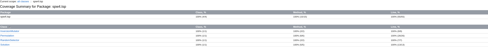
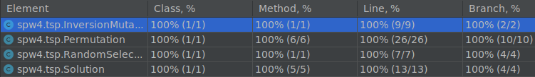
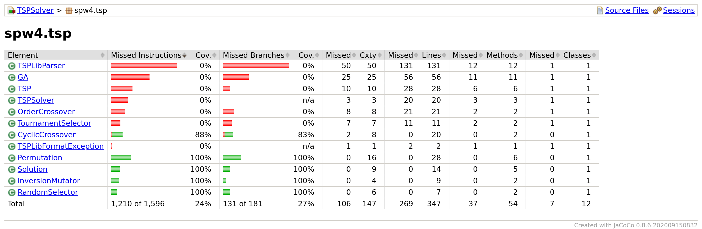

= Exercise 01
:author: Florian Weingartshofer
:email: <S1910307103@students.fh-hagenberg.at>
:reproducible:
:experimental:
:listing-caption: Listing
:source-highlighter: rouge
:src: ../src/test/java/spw4/tsp
:imgdir: ./img
:imagesoutdir: ./out
:stem:

== a

.PermutationTests.java
[source,java]
----
include::{src}/PermutationTests.java[]
----

<<<
== b

.SolutionTests.java
[source,java]
----
include::{src}/SolutionTests.java[]
----

<<<
== c

.RandomSelectorTests.java
[source,java]
----
include::{src}/RandomSelectorTests.java[]
----

<<<
== d

.InversionMutatorTests.java
[source,java]
----
include::{src}/InversionMutatorTests.java[]
----

<<<
== e

The goal of reaching 100% branch coverage has been achieved for:

- Permutation
- Solution
- RandomSelector
- InversionMutator

Here is the Intellij IDEA Report:

.IntelliJ Report

I also included a Jacoco Report, which also covers branch coverage.

.Jacoco Report

